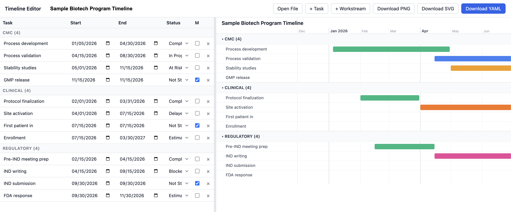
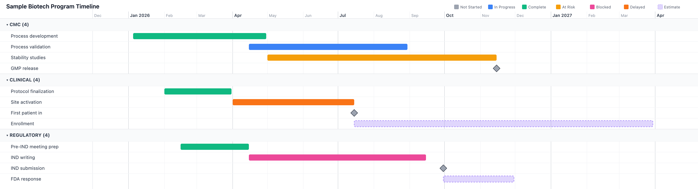

# Project Management Tools

A Claude Code plugin and visual editor for program managers. Covers four workflows that eat up PM time: building and editing program timelines, comparing timeline versions, running structured risk assessments, and writing executive summaries.

Works across domains — software, biotech, financial services, construction, or anything with workstreams and deadlines. The risk assessment skill (`/pm:assess`) ships with biotech-oriented defaults (drug pipeline categories, regulatory pathways) born from real pharma program management, but the interview-and-critique structure adapts to any domain.

Everything runs inside Claude Code — no installs, no dependencies, no terminal commands. Works in both the Claude Code CLI and the Code mode in Claude Desktop. The timeline editor is a single HTML file that opens in any browser.





## What's in the box

### Plugin: `pm`

Four slash commands, each backed by a detailed skill definition:

| Command | What it does |
|---------|-------------|
| `/pm:timeline` | Extracts program timelines from documents (meeting notes, protocols, PDFs), builds them conversationally, or applies bulk edits to existing timelines. Outputs canonical YAML and hands off to the visual editor. |
| `/pm:compare` | Compares two versions of a program timeline — matches tasks by name and workstream, reports date shifts, status changes, added/removed tasks, and per-workstream impact. Optionally outputs a flagged YAML for visual review. |
| `/pm:assess` | Adversarial risk assessment for project critical path. Interviews you for portfolio context, drafts a structured risk register, then stress-tests it with a critic sub-agent across multiple iterations until the analysis is defensible. Ships with biotech/pharma defaults; adaptable to other domains. |
| `/pm:exec-summary` | Concision editor for executive communications. Takes a draft, surfaces questions where your confusion mirrors the reader's, produces a structured rewrite, then runs adversarial critique from the audience's perspective. |

The plugin also includes two critic sub-agents (`risk-critic` and `concision-critic`) that provide adversarial review during the assess and exec-summary workflows.

### Tool: Timeline Editor

A zero-setup browser-based visual editor for program timelines. Imports Excel or YAML, renders an interactive Gantt-style view, and exports to PNG, SVG, or YAML.

Lives at `tools/timeline-editor/index.html` — double-click to open. No server, no build step.

### Supported file formats

All four skills accept files as input. The format determines how the file is parsed:

| Format | How it's read |
|--------|--------------|
| `.xlsx`, `.xls` | Spreadsheet — columns matched by synonym (Task/Activity, Start Date/Begin, etc.) |
| `.yaml`, `.yml` | Structured data — extracted directly if it matches the timeline schema |
| `.json` | Same as YAML |
| `.md`, `.txt` | Unstructured prose — dates, milestones, dependencies, and risk language extracted by analysis |
| `.pdf` | Unstructured prose (extractable text only) |

Multiple files can be provided at once. The skills cross-reference them — a timeline gives dates while a strategy doc gives rationale.

## Install

### Prerequisites

- [Claude Code](https://docs.anthropic.com/en/docs/claude-code) installed and working (CLI or Code mode in Claude Desktop)

### Clone the repo

The timeline editor is a local HTML file, so you need the repo on disk even if you install the plugin from the marketplace.

```bash
git clone https://github.com/gnelson-code/project-management-tools.git
```

Or via SSH:

```bash
git clone git@github.com:gnelson-code/project-management-tools.git
```

### Add the plugin

**From the marketplace (recommended):**

```
/plugin marketplace add https://github.com/gnelson-code/project-management-tools.git
```

Or via SSH:

```
/plugin marketplace add git@github.com:gnelson-code/project-management-tools.git
```

**From a local clone:**

```
claude plugin add /path/to/project-management-tools/plugins/pm
```

Replace `/path/to/project-management-tools` with the actual path where you cloned the repo.

After installing, verify with:

```
claude plugin list
```

You should see `pm` in the output.

### Using the timeline editor

No installation needed. Open the editor directly in your browser:

```
open tools/timeline-editor/index.html
```

Or double-click `index.html` in Finder. Drag an Excel or YAML file onto the page to load a timeline.

## Usage

### Timeline creation and editing

```bash
# Extract a timeline from a document
/pm:timeline meeting-notes.md

# Build a timeline conversationally (no input file)
/pm:timeline

# Edit an existing timeline
/pm:timeline program-timeline.yaml --edit "shift all backend tasks out 6 weeks"

# Bulk shift from a specific task forward
/pm:timeline program-timeline.yaml --shift-from "launch" --by 6w

# Excel files go straight to the visual editor — the skill will redirect you
/pm:timeline master-timeline.xlsx
```

The skill outputs YAML, then prints a link to the visual editor where you can make interactive edits and export to PNG for slides.

### Timeline comparison

```bash
# Compare two Excel snapshots
/pm:compare timeline-v1.xlsx timeline-v2.xlsx

# Compare and output a flagged YAML for visual review
/pm:compare timeline-jan.xlsx timeline-mar.xlsx --yaml

# Mix formats — Excel before, YAML after
/pm:compare old-timeline.xlsx current-timeline.yaml
```

Produces a diff report under `notes/timeline/` showing date shifts, status changes, added/removed tasks, and per-workstream impact. With `--yaml`, also outputs an updated timeline with changed tasks flagged for visual review in the editor.

### Risk assessment

```bash
# Start from input files (timeline, strategy doc, etc.)
/pm:assess phase2-timeline.yaml ~/Desktop/program-strategy.pdf

# Start from scratch — pure interview
/pm:assess

# List existing portfolio context files
/pm:assess --list

# Update a previous assessment with new information
/pm:assess --context program-alpha
```

Produces three artifacts under `notes/risk/`:
- **Portfolio context** — structured record of programs, critical path, and dependencies
- **Risk register** — scored risks with mitigations, stress-tested by the critic
- **Executive summary** — top risks and recommended actions for leadership

### Executive summary editing

```bash
# Edit a draft document into an exec summary
/pm:exec-summary quarterly-update.md --audience "C-suite, non-technical"

# Multiple source files
/pm:exec-summary status-report.md budget-summary.xlsx

# No file — paste or describe content in the conversation
/pm:exec-summary
```

Produces a structured, audience-calibrated summary under `notes/exec/`.

## Repo structure

```
project-management-tools/
├── plugins/pm/                    # Claude Code plugin
│   ├── .claude-plugin/plugin.json
│   ├── commands/                  # Slash command definitions
│   │   ├── timeline.md
│   │   ├── compare.md
│   │   ├── assess.md
│   │   └── exec-summary.md
│   ├── skills/                    # Detailed skill implementations
│   │   ├── timeline/SKILL.md
│   │   ├── compare/SKILL.md
│   │   ├── assess/SKILL.md
│   │   └── exec-summary/SKILL.md
│   └── agents/                    # Critic sub-agents
│       ├── risk-critic.md
│       └── concision-critic.md
├── tools/
│   └── timeline-editor/           # Browser-based visual editor
│       ├── index.html
│       ├── sample-timeline.yaml
│       └── examples/
│           └── sample-program.xlsx
└── notes/                         # Output directory (created by skills)
    ├── timeline/                  # /pm:compare artifacts
    ├── risk/                      # /pm:assess artifacts
    └── exec/                      # /pm:exec-summary artifacts
```

## Authors

Graham Nelson — Lead MLE

[LinkedIn](https://www.linkedin.com/in/grahamenelson/) · [GitHub](https://github.com/grahamnelson) · graham.nelson94@gmail.com

Michelle Nelson — Director of Program Management, Biotech

[LinkedIn](https://www.linkedin.com/in/michelle-pham-nelson/) · mipham626@gmail.com

The biotech-specific defaults in `/pm:assess` (drug pipeline risk categories, regulatory pathway interviews, clinical/CMC/regulatory workstream conventions) come from Michelle's experience in pharma program management.

## License

MIT
